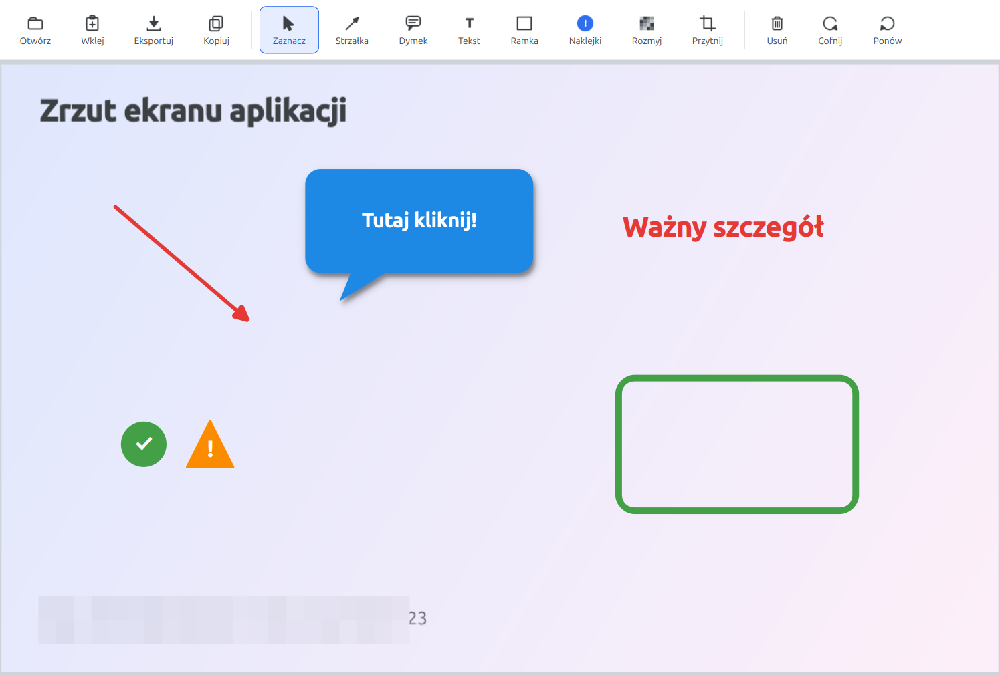

*English | [Polski](README.pl.md)*

# Mazak

A lightweight screenshot annotation editor (mockups, documentation, feedback) — arrows, speech bubbles, text, frames, stickers, blur/pixelate, and crop, each with a live panel for color, thickness, shape, and shadow. Built with Python / PySide6 (Qt6), a native Linux desktop app.



Mazak **does not take screenshots** — use your system's native tool for that (e.g. `Shift+Print Screen` on GNOME). Mazak opens an already-captured image (from a file or straight from the clipboard) and lets you mark it up.

## Features

- **Arrow** — color, thickness, 3 styles (classic / slim / bold), shadow
- **Speech bubble** — color, 3 shapes (rounded / oval / cloud), border on/off, shadow, text inside (font, size, bold, text color, text shadow)
- **Text** — color, font, size, bold, shadow
- **Frame** — color, thickness, sharp/rounded corners, shadow
- **Stickers** — 6 ready-made symbols (exclamation, question mark, check, cross, star, warning), color, size, shadow
- **Blur/pixelate** — drag over sensitive info (passwords, emails) to redact it, adjustable pixelation strength
- **Crop** — drag to select an area, then apply or cancel; existing elements are repositioned or removed accordingly
- Clicking an already-placed element with the **Select** tool re-opens its properties panel — edit it live without redrawing; the panel floats over the canvas instead of resizing it, and the selected element is brought to the front regardless of draw order
- **Paste from clipboard** (Ctrl+V) and **copy result to clipboard** (Ctrl+C) — both scoped to when the canvas has focus, so they never fight with text fields in the panels
- Multi-step **undo/redo** (Ctrl+Z / Ctrl+Shift+Z) covering adding, deleting, and editing elements
- **Polish/English interface** (English by default), switchable live from the toolbar (globe icon), remembered between sessions
- Zoom in/out/fit (toolbar, Ctrl+scroll, or Ctrl+/Ctrl-) with smooth (non-pixelated) image scaling, and middle-mouse-button panning
- Flattened PNG export, remembers the last-used folder (open and export tracked separately)

## Installation

### .deb package (Ubuntu/Debian, recommended)

Download the latest `.deb` file from the [Releases](../../releases) page and install it:

```bash
sudo apt install ./mazak_*.deb
```

The package bundles its own, self-contained PySide6 — no internet access is needed at install time. After installing, you'll find "Mazak" in your application menu.

### From source

Requires Python 3.10+.

```bash
git clone https://github.com/krzysiekslimak/mazak.git
cd mazak
python3 -m venv venv
./venv/bin/pip install -r requirements.txt
./run.sh
```

## Development / testing

The project has no external test framework — behavior is verified by running the app and walking through the relevant flow manually (or with `QTest`). Code layout:

```
mazak/
├── main_window.py   # main window, toolbar, properties panels
├── canvas.py         # QGraphicsView/Scene, tool drawing logic, clipboard, crop
├── items.py           # element classes (ArrowItem, SpeechBubbleItem, TextAnnotationItem, FrameItem, StickerItem, BlurRegionItem)
├── panels.py          # contextual settings panel for each tool
├── undo.py             # Command-based undo/redo stack
├── i18n.py              # PL/EN translation dictionary and live switcher
├── icons.py             # programmatically generated icons (no image assets)
├── style.py              # Qt stylesheet (QSS)
└── tools.py               # tool and variant enums (Tool, ArrowStyle, BubbleShape, StickerKind)
```

## License

[MIT](LICENSE)
